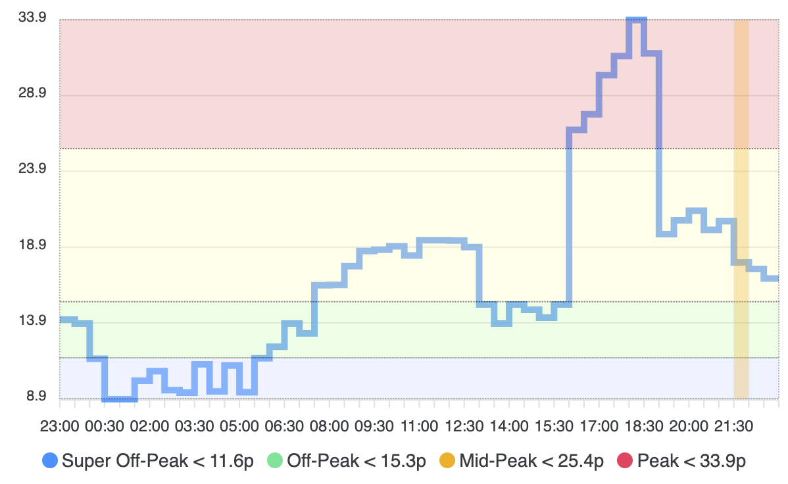
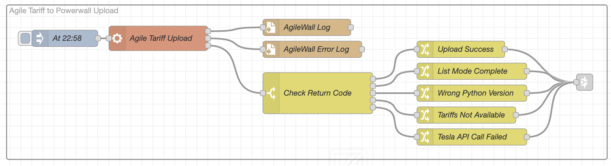

# AgileWall
## TL;DR
A simple python utility to fetch the daily Octopus Agile Import Tariff and load it into the Tesla Powerwall 2.

## Background
This is a long (and some might say rambling) background to development of this utility - mainly to serve as my own *aide-mémoire* for when I come back to this code, but also to explain how I arrived at certain design decisions.

One of the challenges with using a Tesla Powerwall with the Octopus Agile tariff is that there is no official support or integration between them. 
My initial approach was to set up a time based usage tariff in the Powerwall by using the 365 day average data available on the [Energy Stats UK site](https://energy-stats.uk/octopus-agile-northern-scotland/).

This approach worked adequately most of the time, as it allows the Powerwall to leverage the Tesla usage learning algorithm, and allows it to respond to solar forecasts by saving capacity in the battery to capture solar generation.

However, that approach doesn't respond well when the Agile tariff varies outsite the "average" pattern, so I started to investigate how I could use the Agile future rates to configure the battery to more accurately follow the real Agile variations, while still leveraging Powerwall intelligence.

The Powerwall "Utility Rate Plan" supports 4 different tariff types which can be used to label the time slots in the plan which drive the battery charge/discharge behaviour:
* **Super Off-Peak** - Charge the battery and consume from the grid
* **Off-Peak** - Ok to consume from the Grid
* **Mid-Peak** - Prefer not to consume from the grid and use battery
* **Peak** - Don't consume from the grid if possible, and use battery storage

The first challenge is finding a programatic way to put the 48 time slots in the Agile Import Tariff into these 4 rate type buckets. The graph below shows how I have chosen to split up the rates, based on calculated thresholds which will vary as the spread of prices varies.

The Average unit price is the midpoint in the separation of the rates, with Peak, Mid-Peak above that price, and Off-Peak, Super Off-Peak below that price.

* **Mid-Peak** - Price is above Average, but below a price which is mid-way between average and max price; basically 50% of the spread between Average and Max rate price.
* **Peak** - Price is above the mid-way point between Average and Max rate price.
* **Off-Peak** - Price is below Average, but above a price which is mid-way between average and min price; basically 50% of the spread between Average and Min rate price.
* **Super Off-Peak** - Price is below the mid-way point between Average and Min rate price.

**Bucket Time-Slot Merging** - At this stage there are 48 timeslots which are "bucketed" into the relevant tariff types, but loading 48 separate slots into the Powerwall Utility Rate Plan would look a mess, so the next phase optimises each bucket by merging contiguous time-slots. This merge process also calculates the average rate for the new merged slot, as this needs to uploaded to the Powerwall along with the time of use schedule. The end result is a smaller set of time slots which need to be uploaded, and as a result the rate plan view in the Tesla app should clearer and less cluttered.

**Note:** This bucketing approach seems to work pretty well (or at least well enough), and testing it on historical Agile rate data it does returm sensible results. There may be a smarter way to calculate which rate time slot goes into which rate "bucket" but this approach is pretty much the limit of my mathematical and statistical knowledge... 😉 

## Design Considerations
1. **Grid Import Only** - At this stage I'm primarily concerned with self-consumption of solar and load shifting of consumption, so this utility doesn't deal with exporting power. That said, the approach would be the same for the export side, and the Powerwall API to update the export schedule is the same one used in this utility (Time of Use API).
2. **UTC & Local Time** - The Agile Tariff API returns time-slots in UTC, whereas the Tesla Powerwall API works from Local Time, using whatever Time Zone is set in the Powerwall.
3. **Agile Tariff Time Period** - The Octopus Agile Tariff runs from 11pm to 11pm the following day, so this needs to be taken into account when the schedule is uploaded to the Powerwall, as it expects the tariffs to run from midnight to midnight. As a result, the upload to the Powerwall needs to happen just before 11pm - that way the full 24hr look-ahead for the battery is correct.
4. **Tesla API** - Manipulating the Time of Use & Rate Plan information on the Powerwall cannot be done through the local Gateway API connection, so the remote Tesla API must be used. This brings with it the added complexity of dealing with Tesla's OAuth 2.0 Single Sign-On service.
5. **One Powerwall** - This program assumes that you only have one battery (as that's all I have, so I have no way of testing how more than one battery would work). I don't know how the Tesla App deals with >1 batteries - is it seen as a single larger capacity battery, or are the batteries individually visible?

## Possible Future Features
* **Tweak Rate Selection Thresholds** - Monitor the effectiveness of the current approach to bucketing the rates and see if additional parameters are needed to adjust the way thresholds are determined.
* **Home Assistant Integration** - Add the ability to launch / monitor this program from Home Assistant

## External Libraries & Dependencies
This utility uses the [TeslaPy](https://github.com/tdorssers/TeslaPy) Library to access the Powerwall API and to handle the OAuth 2 authentication used by the Tesla API.

Install TeslaPy from PyPi https://pypi.org/project/TeslaPy/
    
    pip install TeslaPy

Alternatively you can install all the dependencies for this program using:
    
    pip install -r requirements.txt

Because of the above dependency and some language features used in this program it will only work with **Python 3.11 or later**.

## Running the app

### Run with "List Only" mode first!
Make sure that you are happy with the Utility Plan Schedules that this program is generating before you let it make any updates to your Powerwall data. 

Another benefit of running in "List Only" mode first is that it tests the end-to-end connectivity to the Tesla API, and goes through the SSO Authentication, caching the Refresh Token so that subsequent API calls don't need you to log on to your Tesla Account.

### Tesla OAuth Single Sign-On (SSO)
The [TeslaPy](https://github.com/tdorssers/TeslaPy) Library implements the OAuth SSO needed by the Tesla API, this means that when you first run the application it will prompt you to log on to your Tesla account using a supplied URL, you will then need to copy the resulting sign-on URL back to the console window. so the program can complete the sign-on.

You only need to carry out this step once, as the SSO refresh token will then be stored in the same folder as the program, in a file named **cache.json**

You should see something like this the first time you run the program:

    Use browser to login. "Page Not Found" will be shown on success.
    
    Open this URL: https://auth.tesla.com/oauth2/v3/authorize?...

    Enter URL after authentication:_

### Important - Scheduling this Program

Because of the fact that the Octopus Agile Tariffs run from 11pm to 11pm the following day it is important to schedule this program to run just before 11pm to ensure that the tariff data sent to the Powerwall is as accurate as possible. Running the program at any other time will result in today's time-slots being overwritten with tomorrow's tarrif data.

If you want to check the changes that will be made, you can run the program with the -L option and it will provide a verbose output of all the tariff data and proposed changes **without sending it to the Powerwall.**

**Note:** The program always attempts to download the next day's Agile tariff, so if the program is run before this data is available on the Octopus API, the program will display an error message and exit.

### Command Line Parameters:
|Arg.| Options | Description|
|--------|---------|------------|
| **-t** | \<Agile Tariff Code\> | If you don't know yours, use the included AgileCodes.py to list all the publicly available tariffs and their associated codes. |
| **-a** | \<DNO Area Code\> | You can find your DNO code here if you don't know it - [DNO Codes Explained](https://energy-stats.uk/dno-region-codes-explained/) |
| **-i** | \<Tesla ID\> | |
| **-d** | \<day_offset\> | 0=today (default), 1=yesterday and so on. |
|        |                | This option is useful for testing the program before the current day's schedule is available, or to check behaviour against historic rates. Automatically switches on List mode to prevent any changes to the Powerwall when using old data. |
| **-L** |  | List the config changes without sending to the Powerwall (Turns on Verbose Output) |
| **-v** | | Verbose Console Output |
| **-c** | | Generate Agile/Powerwall chart output |
| **-o** | \<Path\> | Specify the path to Generate Agile/Powerwall chart files in |

---
**Needless to say, make sure that the Tariff Code and DNO Code are correct for your location otherwise the Agile Tariff data will be wrong...**

**Note:** To see the changes in the Tesla app, you'll need to restart it, as the app appears to cache the Utility Rate Plan and doesn't refresh immediately when it is changed via the API.

### Chart Output
This is an experimental feature which will generate a set of HTML & JS files to render a chart which shows the current Octopus Agile rates with the Powerwall Utility Rate bands overlaid, as shown below.

The chart is rendered from the following files:

- **agile_chart.html**: Static HTML & JavaScript file (uses ApexCharts)
- **chart_options.js**: Static file to configure some chart options:

  - SHOW_LEGEND (true/false): Display a legend below the chart
  - SHOW_TOOLBAR (true/false): Show/Hide the chart toolbar
- **agile_data.js**: Generated file containing the current Agile rates
- **powerwall_rates.js**: Generated file containing the data for the Powerwall rates overlay

#### Chart Setup

By default the files are generated in the current folder where the Python script is executed. If you want to output to a different location, use the -o option to specify the output directory and also copy the agile_chart.html and chart_options.js files to that directory.

#### Rendering the Chart

The best option for viewing the chart is to have the files generated into a directory which is HTTP accessible. In my case I generate the files into a directory and use the Node-Red HTML nodes to serve up the chart.

I'm also using the Webpage card in Home Assistant to render this chart as part of a dashboard while I figure out the best way to integrate this functionality into HA more directly...

### Exit Codes
The program will signal success/failure by returning one of the following exit codes:

| Exit Code | Description |
|:-----------:|-------------|
| **0**     | Program Executed Successfully, new tariffs were fetched and uploaded to the Powerwall |
| **1** | List mode completed successfully |
| **-1** | Incorrect version of Python (must be 3.10 or later) |
| **-2** | Agile Tariffs not available (happens if you run the program before 4pm) |
| **-3** | Failed callinging Tesla Powerwall API |
---
## Running from Node-Red
By using the Exec node, you can call this program as shown below. I've added additional nodes to capture all the output and send alerts to Pushover if anything goes wrong...

## Screen Shots
When you have uploaded the Agile tariff data, you should see something like this on the Tesla iPhone app:

